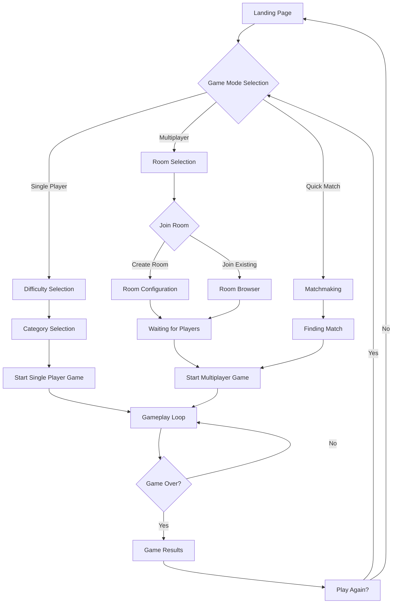
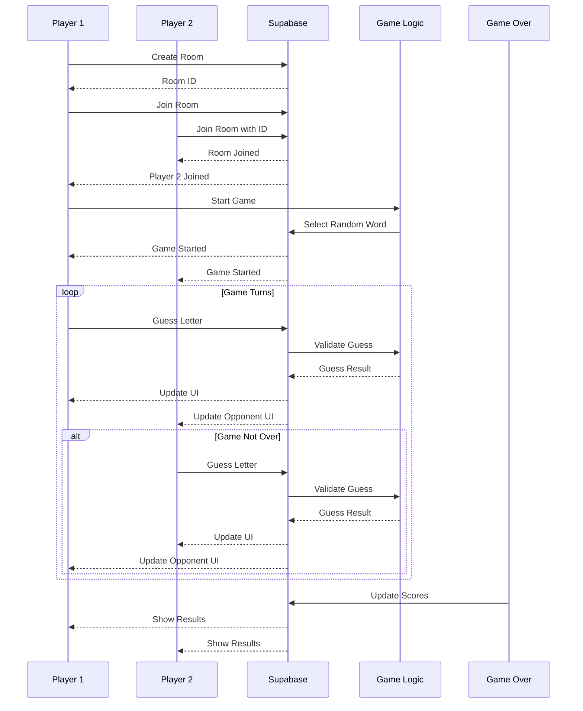
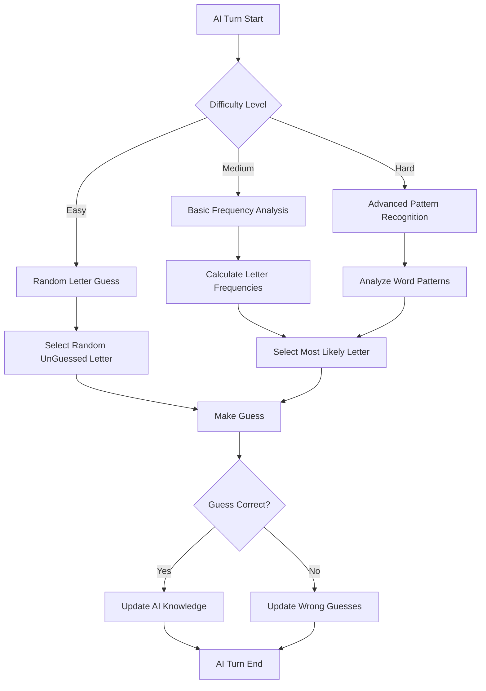
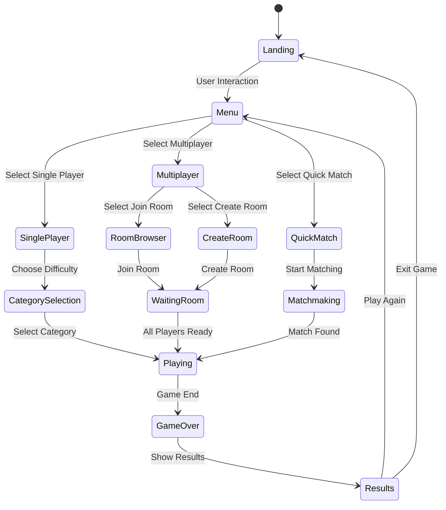
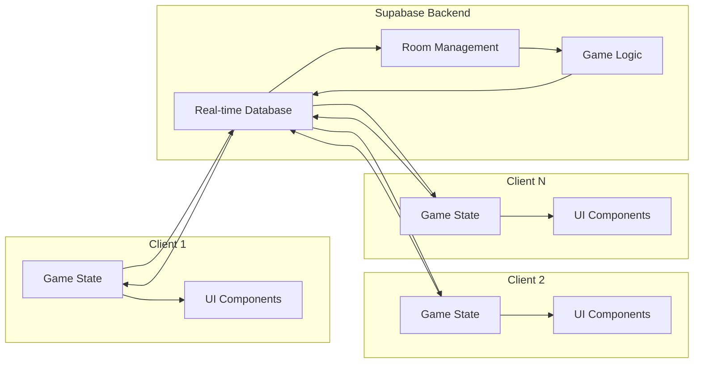

# Hangman Game Flow Diagrams

## User Journey Flow



## Multiplayer Game Flow



## AI Player Logic Flow



## Game States Management



## Real-time Data Synchronization



## Component Architecture

```mermaid
graph TD
    A[App Component] --> B[Router]
    B --> C[Landing Page]
    B --> D[Menu]
    B --> E[Game]
    B --> F[Results]
    
    E --> G[Game Header]
    E --> H[Hangman Drawing]
    E --> I[Word Display]
    E --> J[Keyboard]
    E --> K[Player List]
    E --> L[Chat]
    
    G --> M[Timer]
    G --> N[Score]
    G --> O[Category]
    
    K --> P[Player Card]
    P --> Q[Avatar]
    P --> R[Name]
    P --> S[Status]
    
    L --> T[Message List]
    L --> U[Input Form]